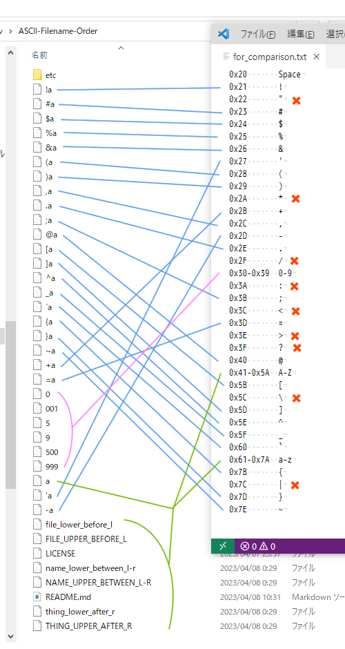
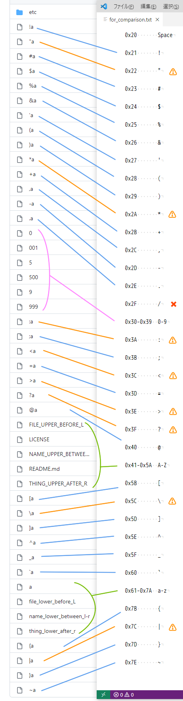

# ASCII Filename Order

Let's see how files are sorted on Windows, GitHub, or any other platform you like.

## Windows



### Sorting

- Numbers are sorted numerically.
- Case insensitive.

### Limitations

- Leading and trailing spaces are trimmed.
- Some symbols cannot be used: `"` `*` `/` `:` `<` `>` `?` `\` `|`

Confirmed on Windows 10 Home 64-bit 22H2.

## GitHub

See the [`invalid-on-Windows`](https://github.com/Phroneris/ASCII-Filename-Order/tree/invalid-on-Windows) branch for these files.



### Sorting

- All are sorted in ASCII order, including numbers.

### Limitations

When you "Create new file" on GitHub,

- Leading and trailing spaces are trimmed.
- Slash `/` cannot be used.
- Symbols other than `/` that cannot be used in Windows, namely `"` `*` `:` `<` `>` `?` `\` `|`, *can* be used here, but may cause serious errors if the repository is cloned on Windows:
  ```
  error: invalid path ':a'
  error: invalid path '\a'
  error: unable to create file "a: Invalid argument
  error: unable to create file *a: Invalid argument
  error: unable to create file <a: Invalid argument
  error: unable to create file >a: Invalid argument
  error: unable to create file ?a: Invalid argument
  error: unable to create file |a: Invalid argument
  ```

Confirmed on Google Chrome 111.0 on 2023-04-08.

## Other OS

Wanted.

As far as I've heard,
- Mac doesn't allow `/` and `:`.
- Unix allows even `\n`.

# Appendix

## ASCII Codes

FYI.

- 0x00-0x1F, 0x7F (DEL)
  - Control characters
- 0x20-0x2F
  - Space, `!`, `"`, `#`, `$`, `%`, `&`, `'`, `(`, `)`, `*`, `+`, `,`, `-`, `.`, `/`
- 0x30-0x3F
  - 0-9, `:`, `;`, `<`, `=`, `>`, `?`
- 0x40-0x4F
  - `@`, A-O
- 0x50-0x5F
  - P-Z, `[`, `\`, `]`, `^`, `_`
- 0x60-0x6F
  - `` ` ``, a-o
- 0x70-0x7E
  - p-z, `{`, `|`, `}`, `~`
